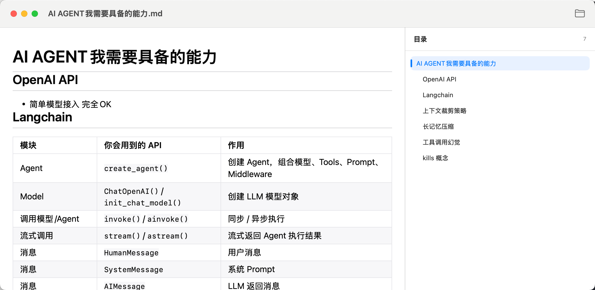

# MDReader

一个简洁、专注阅读体验的 macOS Markdown 阅读器。



## 适合做什么

MDReader 适合阅读笔记、技术文档、项目说明、知识库和长篇 Markdown 文件。打开文档后，正文在左侧显示，右侧会自动生成目录，方便快速跳转到任意章节。

## 下载与安装

1. 在 GitHub 的 **Releases** 页面下载最新的 `MDReader.dmg`。
2. 双击打开 DMG 文件。
3. 将 `MDReader.app` 拖入 `Applications` 文件夹。
4. 从“应用程序”或 Launchpad 启动 MDReader。

如果 macOS 首次打开时提示无法验证开发者，可以在“系统设置 → 隐私与安全性”中允许打开 MDReader。

## 打开 Markdown 文件

启动应用后，点击窗口右上角的文件夹按钮，选择 Markdown 文件即可。

支持以下文件格式：

- `.md`
- `.markdown`

也可以使用快捷键：

```text
⌘O    打开 Markdown 文件
```

## 阅读与导航

- 右侧目录会显示文档中的 H1–H6 标题。
- 点击目录中的标题，可以立即跳转到对应位置。
- 滚动正文时，目录会自动高亮当前章节。
- 标题层级越深，目录缩进越多。
- 没有标题的文档仍然可以正常阅读。
- Markdown 正文为只读，不会修改原始文件。

## 图片显示

### 网络图片

文档中的网络图片会自动加载，需要确保 Mac 可以访问对应网址。

### 本地图片

如果 Markdown 使用了相对路径图片，应用会提示选择图片所在文件夹。请选择当前文档所在目录，或包含该目录的父文件夹。

图片授权只用于读取图片，不会修改文件；即使不授权，也不影响 Markdown 正文阅读。

## 常见问题

### 为什么右侧没有目录？

请确认文档使用了标准 Markdown 标题，例如：

```markdown
# 一级标题
## 二级标题
```

### 为什么图片没有显示？

网络图片需要网络连接；本地相对路径图片需要在提示出现时授权正确的文件夹。

### MDReader 会修改我的文件吗？

不会。MDReader 是只读阅读器，不会编辑、保存或覆盖原始 Markdown 文件。

## 系统要求

- macOS 15.4 或更高版本
